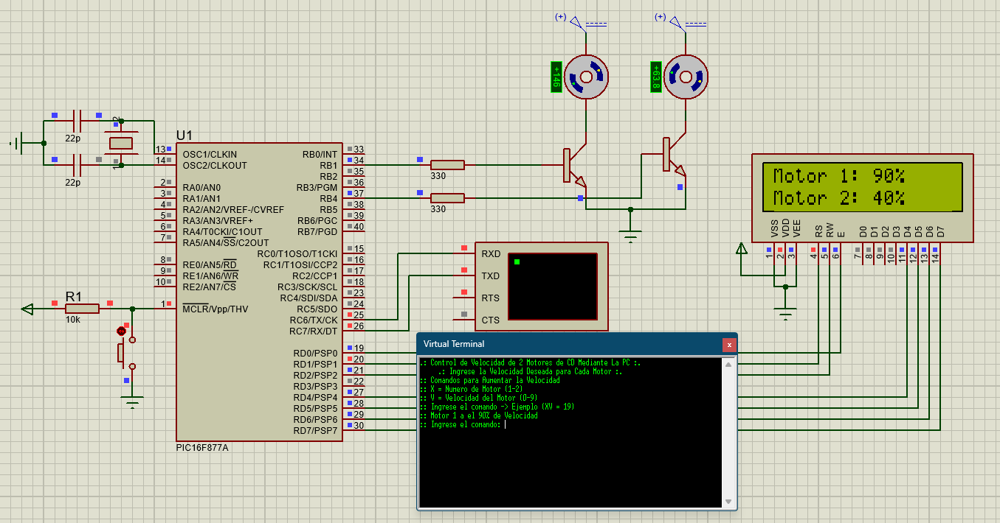

# `PIC16F877A` Control de dos Motores DC Mediante Comunicación RS-232

Este proyecto utiliza un microcontrolador PIC16F877A para controlar dos motores DC de manera independiente mediante la comunicación RS-232.

## Componentes
- Microcontrolador : PIC16F877A
- 2 Motores DC
- Pantalla LCD
- 2 Transistores 

## Herramientas de Desarrollo
- Proteus 11 para la simulación
- Lenguaje de programación: C

## Archivos del Proyecto
- `Código fuente` : "Independent_Motor_Speed.c"
- Archivo .hex para la programación del microcontrolador
- Archivo .cof para depuración

## Diagrama de Conexión
- Se incluye una imagen PNG que muestra el diagrama de conexión entre los componentes
- Tambien se añade la simulacion realizada en Proteus

## Licencia
Este proyecto está bajo la licencia MIT. Consulta el archivo `LICENSE` para obtener más detalles.

-------------------------------

# `PIC16F877A` Control of Two DC Motors Through RS-232 Communication

This project uses a PIC16F877A microcontroller to independently control two DC motors through RS-232 communication.

## Componentes
- Microcontroller: PIC16F877A
- 2 DC Motors
- LCD Screen
- 2 Transistors

## Development tools
- Proteus 11 for simulation
- Programming language: C

## Project files
- `Source code` : "Independent_Motor_Speed.c"
- .hex file for microcontroller programming
- .cof file for debugging

## Connection diagram
- A PNG image is included showing the connection diagram between the components
- The simulation carried out in Proteus was also added
  
## License
This project is under the MIT license. See the `LICENSE` file for more details.

-------------------------------

 

